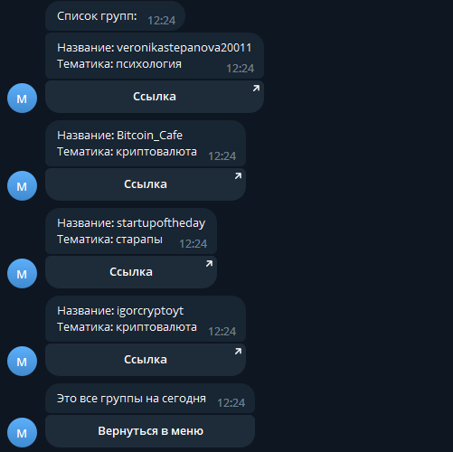

# Тестовое задани

_Создание артихеткуры телеграм бота_

___


## Стек
* aiogram
* postgresql
* asyncpg
* sqlalchemy
* alembic

___

## Как устроен бот

При запуске бота командой __/start__ отображается __приветственное меню__:
<a id='main_menu'></a>
</a>

> _После вызова команды /start проверяется, есть ли этот пользователь в бд. Если нет - он вносится в базу._

Если выбрать __подобрать группу__ бот составит актуальный __набор тематик__ для подбора группы. Данные берутся из бд в кэшированном виде.


> _Остальные команды становятся недоступны на момент выбора тематики. Попытка вызова команд сопровождается сообщением об ошибке._

После выбора тематики бот входит в состояния __анкетирования__. Анкетирования происходит пока не закончатся __все вопросы__ по данной тематике.


> _Вопросы также берутся из бд._

> _Ответы на вопросы на данный момент игнорируются, так как в ТЗ их дальнейшее применение не было указано._

> _Каждый вопрос в отдельным сообщение. После ответа сообщение удаляется._

После завершения анкетирования бот выдаёт __список всех групп__ по выбранной __тематике__.


> _Каждая группа выводится в отдельным сообщение с кнопкой-ссылкой. Чтобы избежать блокировку бота за спам, отправка сообщений происходит в асинхронной цикле for с задержкой (на данный момент задержка 0.5 секунды)._

Кнопка [__Вернуться в меню__](#main_menu) возвращает начальное меню. А __кнопка-ссылка__ отправляет на группу с тематикой.

Кнопка __Список групп__ из главного меню выводит __список всех групп__, что имеются в базе на данный момент.



> _Каждая группа выводится в отдельным сообщение с кнопкой-ссылкой. Чтобы избежать блокировку бота за спам, отправка сообщений происходит в асинхронной цикле for с задержкой (на данный момент задержка 0.5 секунды)._

> _Запрос к бд выполняется асинхронно, поэтому в этом момент бот не "ложится". Если в базе окажется много записей с группами вывод отдельного сообщения для каждой группы не лучшее решение._

> _Архитектура бота позволяется быстро переписать вывод списка групп в одно сообщение (изначально так и было сделано), но в этом случае будут потеряны кнопки-ссылки._

Команда __/admin__ доступна только тем пользователям, чей _user_id_ был внесён в переменную __data.settings.bots.admins__.


> _Переменная admins заполняется при инициализации бота, данные берутся из переменной окружения._

Если выбрать __Выгрузить пользователей__ происходит асинхронная __запись всех пользователей__ из бд в __Excel файл__. При успешной записи появляется уведомление с названием дампа. Сообщение об ошибке в иных случаях.


> _Каждый callback из админ панели проверяет наличие пользователя в переменной admins._

> _Файл сохраняется в директории dumps._

Если выбрать кнопку __Отправить сообщение пользователям__ бот войдёт в состояние __ожидания сообщения__ от админа. После получения сообщения бот __рассылает__ это сообщение __по всем пользователям__ из бд.


> Рассылка происходит в асинхронном цикле for с задержкой в 0.5 секунды.

___

## <a id='schemes'>__Структура базы данных__</a>

#### Схема сущности <a id='users_scheme'>users</a>:
id | user_id | full_name | is_admin
:--|:--------|:---------:|:--------:
1 | @WATYNeed | Max Rabotyaga | true
... | ... | ... | ...

#### Схема сущности <a id='groups_scheme'>groups</a>:
id | group_name | link | theme_id
:--|:-----------|:----:|:--------:
1 | Bitcoin_Cafe | https://t.me/Bitcoin_Cafe | 2
... | ... | ... | ...

>_Сущности [themes](#themes_scheme) и [groups](#groups_scheme) связаны по атрибуту [theme_id](#groups_scheme) (один ко многим)_

#### Схема сущности <a id='themes_scheme'>themes</a>:
id | theme 
:--|:------:
1 | психология
... | ... 

>_Сущности [themes](#themes_scheme) и [questions](#questions_scheme) связаны по атрибуту [theme_id](#questions_scheme) (один ко многим)_

#### Схема сущности <a id='questions_scheme'>questions</a>:
id | question | theme_id
:--|:---------|:--------:
1 | Вы псиохолог? | 1
... | ... | ... | ...

___

## Добавление новых групп, тематик и вопросов

Бот выводит информацию основываясь на бд. Поэтому каждый запрос к боту выводит актуальных данные.

Для создания тематики, группы или вопросов нужно внести данных о них в нужную [таблицу](#schemes).

>_Задание выполнялось строго по ТЗ. Поэтому я не реализовал заполнение групп, вопросов и тематик через админку в самом боте, хотя это можно легко сделать._

Пример
: Чтобы создать логическую ветку про разработку бота, нужно выполнить SQL запросы:
        ```
        INSERT INTO themes (id, theme) VALUES (4, 'разработка ботов');
        INSERT INTO groups (group_name, link, theme_id) VALUES ('TGStat_Bot', 'https://t.me/TGStat_Bot', 4);
        INSERT INTO questions (question, theme_id) VALUES ('Вы разрабатываете ботов?', 4);
        ```
    Изменения будут внесены в базу и видны всем пользователя (без перезапуска бота)

___


## Преимущества архитектуры

* Полностью асинхронная работа. В том числе:
    * записи дампа пользователей в xlsx
    * цикла перебора групп, тематик и вопросов
    * запросов к бд
* Масштабируемость, модульность
* Разделения слоёв моделей, отображения и бизнес-логики
* Лёгкое изменение списков групп, вопросов и тематик без перезапуска бота
* Простая миграция моделей в сущности бд
* Возможен переход на другую СУБД по шаблону
* Быстрое создание новых SQL запросов и моделей по шаблону
* Отсутствие зависимости запросов к определённой СУБД

___

## Недостатки архитектуры

* При большом количестве записей в бд пользователь может долго ждать ответ на свой запрос (особенно при переборе всех групп). Исправляется добавление noSQL базы с кэшированием данных, например Redis.

___

## Добавление новых сущностей в бд

1. Создать модуль  __database.models.<table_name>.py__
2. Создать класс __\<TableName>__ и наследовать от __ModelBase__:
    ```
    # database.models.table_name.py
    from database.models.model_base import ModelBase

    class TableName(ModelBase):
        pass
    ```
3. Добавить в файл __database.models.\_\_init\_\_.py__ импорт:
    ```
    # database.models.__init__.py
    ...
    from .table_name import TableName
    ```
4. Создание миграции:
    ```
    alembic revision --autogenerate -m '<migration_name>'
    alembic upgrade head
    ```

___

## Добавление новых запросов в бд

1. Создать модуль __database.queries.<query_name>.py__
2. Создать класс __\<QueryName>__ и наследовать от __QueryBase__:
    ```
    # database.queries.query_name.py
    from database.queries.query_base import QueryBase
    from sqlalchemy.ext.asyncio import AsyncSession
    
    class QueryName(QueryBase):
        @staticmethod
        async def query(session: AsyncSession):
            pass
    ```
3. Написать логику запроса в переопределённом методе __query__.
4. Добавить __database.queries.\_\_init\_\_.py__ импорт:
    ```
    # database.queries.__init__.py
    from .query_name import QueryName
    ```

___

## Добавление в handlers
1. Создание _callback_:
    1.1 Создать модуль __handlers.callbacks.<callback_name>.py__ 
    1.2 Создать метод для обработки _callback_:
    ```
    # handlers.callbacks.callback_name.py

    @dp.callback_query_handler(text='callback_data')
    async def callback_name_callback_handler(call: types.CallbackQuery):
        pass
    ```
    1.3 Добавить в __handlers.callbacks.\_\_init\_\_.py__ импорт:
    ```
    # handlers.callbacks.__init__.py
    ...
    from .callback_name import dp
    ```
2. Создание _command_:
    1.1 Создать модуль __handlers.commands.<command_name>.py__ 
    1.2 Создать метод для обработки _command_:
    ```
    # handlers.commands.command_name.py

    @dp.message_handler(commands=['command_data'])
    async def command_name_command_handler(msg: types.Message):
        pass
    ```
    1.3 Добавить в __handlers.commands.\_\_init\_\_.py__ импорт:
    ```
    # handlers.commands.__init__.py
    ...
    from .command_name import dp
    ```

___

## Добавление inline меню

1. Создать модуль __keyboards.inline.<menu_name>.py__
2. Создать функцию:
    ```
    # keyboards.inline.menu_name.py
    from aiogram.types import InlineKeyboardMarkup

    async def get_menu_name_inline_markup() -> InlineKeyboardMarkup:
        pass
    ```
3. Добавить в __keyboards.inline.\_\_init\_\_.py__ импорт:
    ```
    # keyboards.inline.__init__.py
    ...
    from .menu_name import dp
    ```
___

## Добавление машины состояний

1. Создать модуль __stats.<state_machine_name>.py__
2. Создать класс __\<StateMachineName>__ и наследовать от __StatesGroup__:
    ```
    # state.state_machine_name.py
    from aiogram.dispatcher.filters.state import StatesGroup

    class StateMachineName(StatesGroup):
        pass
    ```
3. Добавить в __states.\_\_init\_\_.py__ импорт:
    ```
    # states.__init__.py
    ...
    from .state_machine_name import StateMachineName
    ```
    
___

## Подключение новой СУБД

1. Создать модуль __database.<dms_name>.py__
2. Создать класс __\<DMSName>__ и наследовать от __DMSBase__ и реализовать метод __make_request__:
    ```
    # database.dms_name.py
    from database import DSMBase

    class DMSName(DSMBase):
        async def make_request(self, query_class: QueryBase, *args, **kwargs):
            pass
    ```
3. Добавить в __database.\_\_init\_\_.py__ импорт:
    ```
    # database.__init__.py
    ...
    from . import DMSName
    ```

4. Добавить в датакласс __Databases__ модуля __data.settings.py__ название переменной для __url__ новой субд:
    ```
    ...
    class Databases:
        ...
        dms_name_url: str
    ```
5. Добавить в функцию __\_\_get\_settings__ модуля __data.settings.py__ значение __url__ новой субд:
    ```
    def __get_settings() -> Settings:
        ...
        return Settings(
            ...,
            databases=Databases(
                ...,
                dms_name_url=<название_субд+библиотека://логин:пароль@хост:порт/название_бд>
            ),
            ...
        )
    ```

6. Добавить в loader.py создание объекта субд:
    ```
    from database import DMSName

    db = DMSName()
    ```
    
___


Ссылка на бота: https://t.me/promoter_tgbot

> На сервер не задепроин, поэтому может не работать.

___
